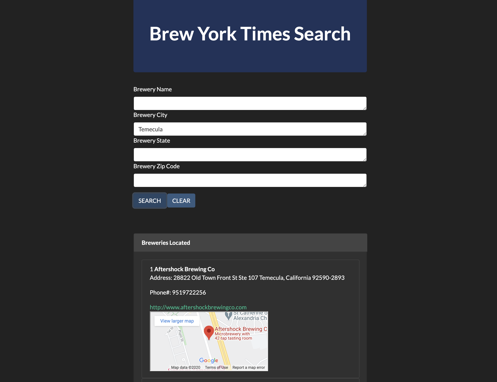

# Project1

Prompt the User for Brewery Search Criteria including: 1. zip code 2. City and State

Return a list of breweries to display to the user (API: https://www.openbrewerydb.org/documentation/03-search)

Allow the user to select one of the displayed breweries

Returned breweries will have website information added if available. 

When the user selects the brewery they want, it gives them a clickable thumbnail map. 

If the user clicks on the map, Google Maps will open in a new window and the user can get directions from there.

The users information entered gets stored into local storage. 

Link to presentation: https://docs.google.com/presentation/d/1PbYuluuBx2s1WfVx4wta3FTGW0p8ORTw8U-Hlu_pRiI/edit?usp=sharing

